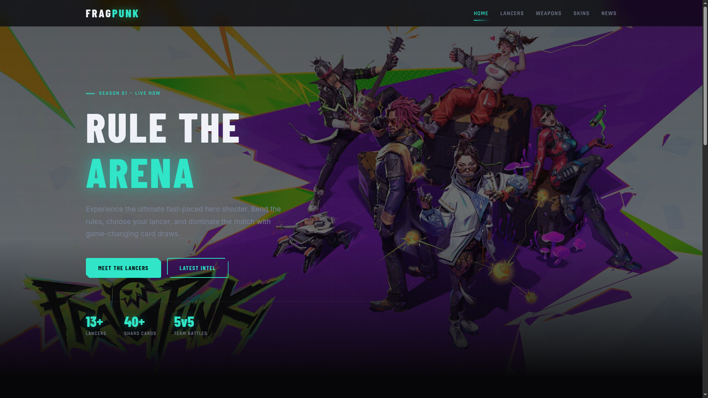

# FragPunk — Fan Website Redesign

A fully hand-coded fan-made redesign of the [FragPunk](https://www.fragpunk.com) official website, built as a portfolio project with a strong focus on UI polish, typography, and visual identity.



---

## Overview

This project reimagines the FragPunk website from the ground up using vanilla HTML, CSS, and JavaScript — no frameworks, no build tools. Every layout, animation, and interaction was crafted by hand to match the high-energy aesthetic of the game while improving on the original's structure and readability.

## Pages

| Page | Description |
|------|-------------|
| `index.html` | Main landing page with hero section and highlights |
| `lancers.html` | Full roster of playable Lancers |
| `lancer-detail.html` | Individual Lancer detail view |
| `weapons.html` | Weapons showcase |
| `skins.html` | Skins & cosmetics gallery |
| `news.html` | Latest news and patch updates |

## Tech Stack

- **HTML5** — semantic markup and page structure  
- **CSS3** — custom properties, animations, responsive layout  
- **Vanilla JS** — dynamic interactions and DOM manipulation  

## Project Structure

```
fragpunk-new-website/
├── index.html
├── lancers.html
├── lancer-detail.html
├── weapons.html
├── skins.html
├── news.html
├── css/              # Stylesheets
├── js/               # JavaScript files
├── lancers/          # Lancer character images
├── weapons/          # Weapon images
├── skins/            # Skins & cosmetics images
└── site-assets/      # UI elements, backgrounds, icons
```

## Key Features

- **Refined UI** — redesigned layout with improved visual hierarchy and spacing
- **Custom typography** — carefully chosen fonts and type scale matching the game's identity
- **Fully responsive** — adapts cleanly across desktop and mobile viewports
- **Multi-page structure** — separate dedicated pages for each content category
- **Smooth interactions** — hover effects and transitions throughout

## Purpose

Built for practice and as a portfolio piece to demonstrate front-end skills in UI design, layout, typography, and vanilla web development — without any frameworks or libraries.

---

> **Disclaimer:** This is an unofficial fan project. FragPunk and all related assets are property of NetEase Games. This site is not affiliated with or endorsed by the developers.